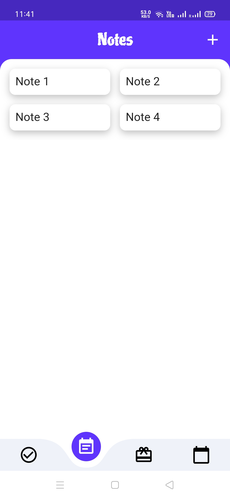
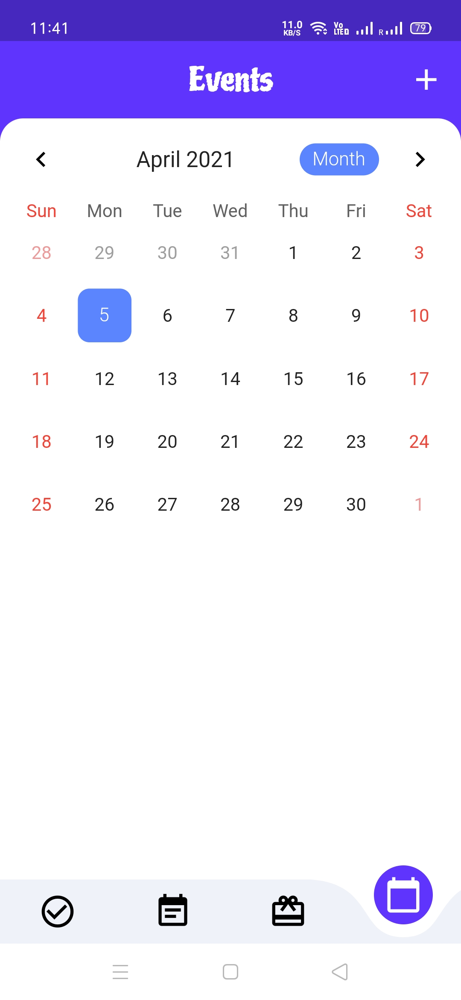

# Remember
A Flutter app to manage daily tasks, add notes, remind birthdays & other events

## Frameworks
- FlutterLocalNotification
- SqfLite

## Screenshots

<pre>
            

            
</pre>

## License

<!-- ## Get Started
1. Install Android Studio & Flutter.
2. Clone the repository & run in debug mode.
3. To find apk -> build/app/outputs/apk -->

